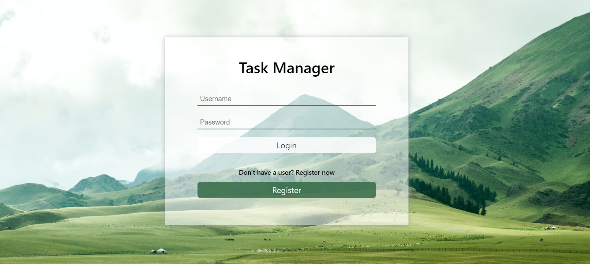
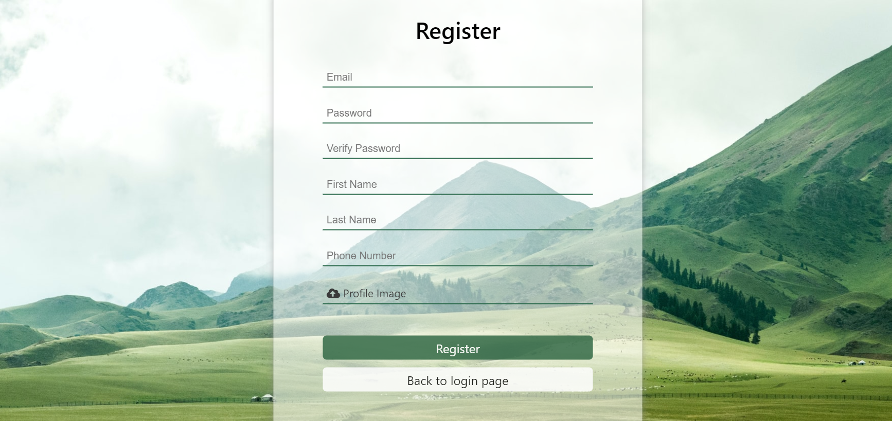
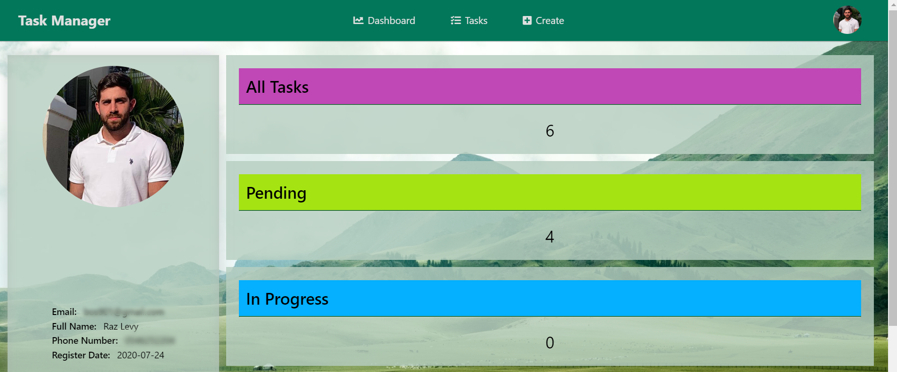
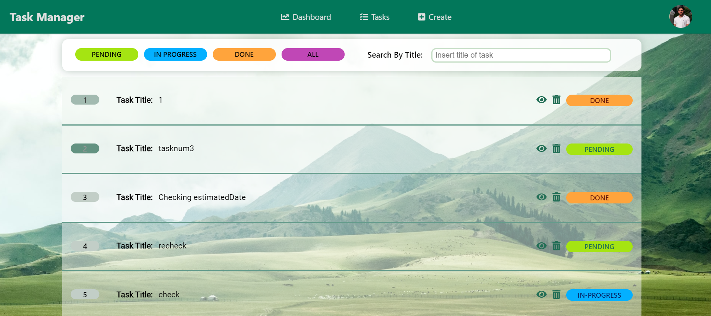
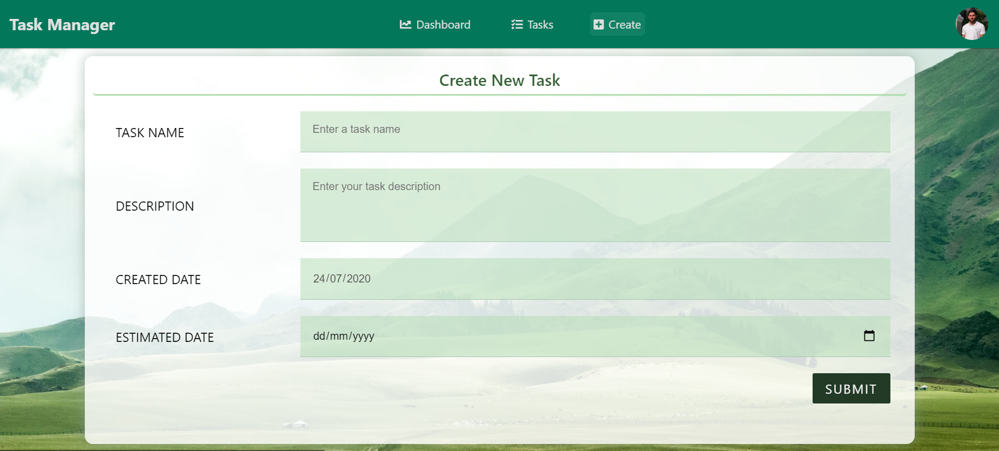

# Task Management System
A project that helps the end-user to manage his tasks and manage their status.

## Used Platforms
- ReactJS
- Redux
- NodeJS
- SQL
- AWS S3

## Installation Instructions
Download the repository and use `npm install` to install all the related modules. 
Please fill the .ENV file with your database & AWS S3 configuration 

## How does it work
There are 3 main systems in the project:
1. Sign-up  - The user is required to fill in all the related information and upload a image for the profile picture (which will be uploaded to AWS S3) and pick his username and password. At the end of the process the information will be saved in a database after encrypting the password.
2. Sign-in - The user is required to fill in his username and password, During the process, the entered password will be encryped and checked in a DB, and in case it's a match, there will be an injection of token to the user's local storage.
3. Create / View tasks - In this process, the user will be able to add, view, and manage his tasks' status, which will be saved to a database table.

## Pictures

